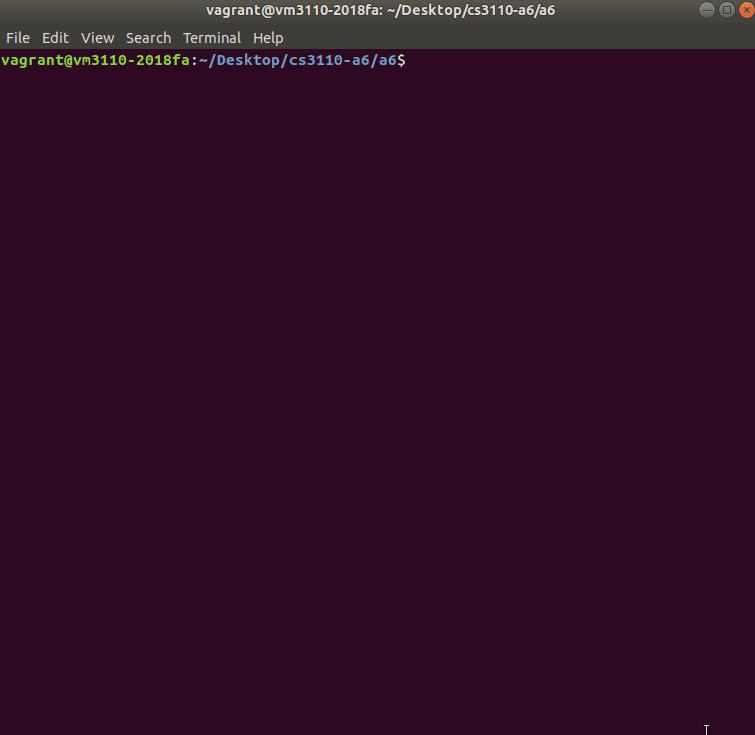
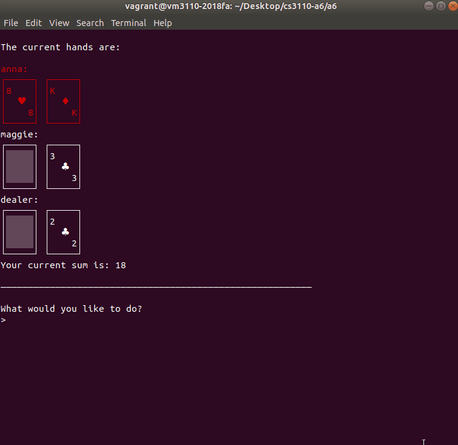
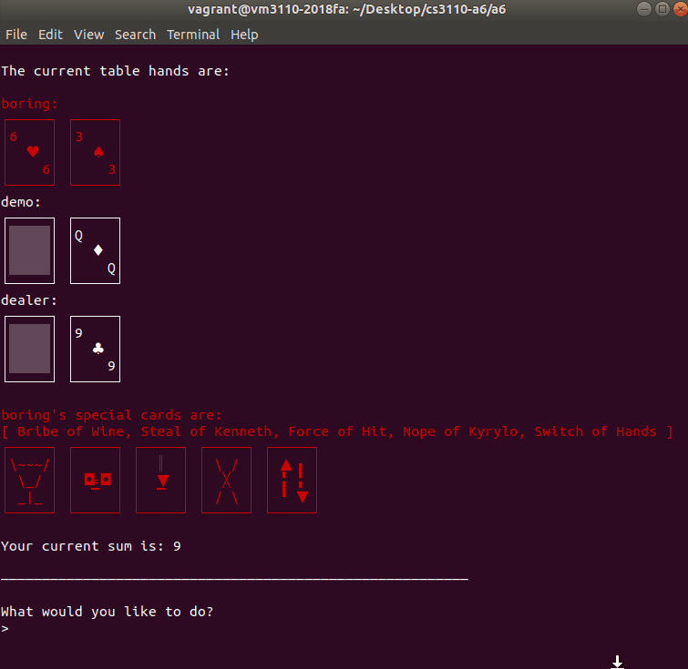

# Exploding BlackJack

Made by:
  
  - Anna Huang  
  - Maggie Liu  
  - Bryan Guan  

## How to Run

OCaml is needed to run the game. Open terminal and `cd` to folder `ebfiles` and enter command `make play`.

## How to Play

Exploding Blackjack has two game modes - traditional BlackJack (Normal) and Exploding BlackJack (Special). Players have an option to choose which to play in the main menu.  
  
To save a file, enter save anytime during a game.  
  
To load files, enter load on the main menu and type the name of the file you want to load.
  
To delete files, type delete on the load screen.  
  
The official rules for each game are listed below.
  
## Rules
  
### { NORMAL }
  
  At the start of the game, each player is dealt two cards, one face up, 
  and one face down. You may only view your own facedown card.
  The objective of the game is to get as close to 21 while beating the dealer.
  Face cards are valued at 10, Aces can be valued at either 1 or 11, 
  while all other cards are valued at their pip value. 
  You bust if your hand goes over 21 during any round, and lose if the dealer
  gets closer to 21 than you do. Players will go in the order that their names
  are entered in with the dealer going last. 
  During their turn, players can either [hit] or [stand]. If you [hit], you
  will receive another card. If you [stand], your turn will end for the round.
  At the end of each round, the player with the highest score will receive 
  1 pt and if there is a tie, all players in the tie will receive 1 pt. 
  The game ends if either the deck runs out, or one player reaches 8 pts.
  
### { SPECIAL }

  There is now a new deck containing special cards that has been shuffled 
  in with a normal set of playing cards.
  
  The new cards include:
  - *bomb cards* called "Clarkson of Gates461", which will explode when hit.
    The player will lose 6 pts if the bomb explodes. 
  - *defuse cards* called "Bribe of Wine" that allow the player to safely
    counteract the bomb. Each player starts the game with one defuse card.
  - *foresee cards* called "Foresee of Future", which allows the player to 
    view the next three cards in the hit deck.
  - *shuffle cards* called "Shuffle of Mystery", which allows the player to
    shuffle the hit deck.
  - *steal cards* called "Steal of Kenneth", which allows the player to steal
    a faceup card from the table hand of another player.
  - *switch cards* called "Switch of Hands", which allows the player to switch
    table hands with another player.
  - *force hit* called "Force of Hit", which lets the player force the next
    player to hit from the deck.
  - *nope cards* called "Nope of Kyrylo", which allows the player to 
    counteract any special card being used against them.
      
  At the beginning of the game, each player will be dealt 2 hands, one on the 
  table like in blackjack and a special hand containing only special cards
  that contains 1 defuse card to begin with. The special hand will be kept
  throughout the rounds while the table hand will be re-dealt each round. 
  When a player hits, number cards will be placed in the table hand face-up 
  while special cards will be placed directly in the special hand. 
  Players can perform any actions, such as hitting or using a special card 
  until the player busts, chooses to stand, or otherwise end their turn by
  using a special card. If a bomb is hit, it may be defused with a defuse card
  and the player will have to opportunity to place it back into the deck into 
  a location that only they know. If the user doesn't have a defuse card, 
  they will lose 6 points and their turn will end. If any player's points 
  reach -10, they will automatically lose and cannot play in future rounds.
  The game ends if any player reaches 8 pts, if there is only a single
  player left in the game, or the deck runs out of cards. In the latter case,
  the player with the highest points currently is declared the winner.

### { TIPS/SHORTCUTS }
  
  try typing:
  - [n] instead of [next], 
  - [h] instead of [hit], 
  - [s] instead of [stand].

## Screenshots

### Saving/Loading

### Normal

### Special

